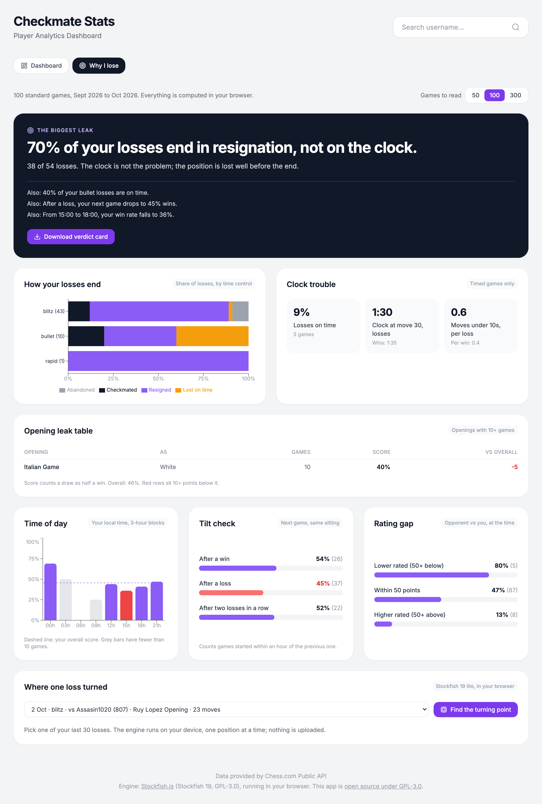

# Chess stats dashboard

A free Chess.com stats dashboard with a second view, **Why I lose**, that reads your recent games in the browser and tells you where your losses actually come from.

Built for [Buildtober](https://github.com/amit-srivatsa) day 3 (3 October 2026): one tool a day through October.

**Live Demo**: [https://amit-srivatsa.github.io/chess-stats/](https://amit-srivatsa.github.io/chess-stats/)



## Two views

**Dashboard** (the original app): profile, current ratings, win rate, rating chart, performance by colour and recent games, from the latest month of games.

**Why I lose** (new): one rules-based headline, then the numbers behind it.

| Section | What it answers |
| --- | --- |
| The biggest leak | One sentence, picked by simple rules from the sections below. Downloadable as a 1080 x 1080 card. |
| How your losses end | Checkmated, resigned, lost on time or abandoned, split by time control. |
| Clock trouble | Share of losses on time, clock left after move 30 (losses vs wins), moves played with under 10 seconds. |
| Opening leak table | Score by opening family and colour. Rows under 10 games are hidden; rows 10+ points below your average are flagged. |
| Time of day | Score by 3-hour block in your local time. |
| Tilt check | Score in the next game after a win, a loss, or two losses in a row (same sitting only). |
| Rating gap | Score against lower rated, similar and higher rated opponents. |
| Where one loss turned | Optional. Runs Stockfish on one loss you pick and marks the move where your win chance dropped the most. |

Under 30 games the page shows a "too few games" note instead of a verdict.

## How it works

Everything runs in the browser. There is no backend, no account and no AI model.

1. **Fetch** (`services/chessApi.ts`): reads the monthly archive list, then walks backward one month at a time until 50, 100 or 300 standard games are loaded. Requests are serial, never parallel.
2. **Cache** (`lib/cache.ts`): each month is stored in IndexedDB. Past months never change, so they are kept for good; the current month is always refetched.
3. **Normalise** (`lib/games.ts`): one flat record per game: colour, result, how it ended, opening family, local start hour, ratings, and your clock after every move (read from the `%clk` tags in the PGN). Variants are skipped. [chess.js](https://github.com/jhlywa/chess.js) replays the moves for the engine view.
4. **Stats** (`lib/stats.ts`): pure functions, records in and numbers out.
5. **Headline** (`lib/headline.ts`): each rule proposes at most one finding with a score (how far from normal, in points); the highest score wins.
6. **Engine** (`lib/engine.ts`, `lib/turningPoint.ts`): the lite single-threaded Stockfish 19 build runs as a Web Worker. Each position is searched to depth 12 with a cleared hash, so the same game gives the same answer every time. Scores become win chances with the Lichess formula (`50 + 50 x (2 / (1 + e^(-0.00368208 x cp)) - 1)`, clamped to +-1000 cp, from `lila/ui/lib/src/ceval/winningChances.ts`). The turning point is your move with the biggest drop while you still had 25% or more; if you never did, it falls back to the biggest drop anywhere. A 23-move game takes a few seconds on a laptop. Results are cached per game.

### Data handling

- Chess.com game data is public. The app only reads it; nothing is sent anywhere else.
- Games, stats and engine results stay in your browser (IndexedDB and localStorage). Clear site data to remove them.
- The verdict card is drawn in the page and saved by your browser. No upload.

## Run it locally

Requires Node.js 18 or newer.

```bash
npm install
npm run dev
```

Then open http://localhost:3000 and pick the **Why I lose** tab (or go straight to `/#why`).

`npm run dev` and `npm run build` first copy the Stockfish files from `node_modules/stockfish/bin` into `public/engine/` (see `scripts/copy-engine.mjs`). The output in `dist/` is static and can be hosted on GitHub Pages or Vercel without special headers.

## What I left out

- **AI.** The first version only counts. The numbers were already blunt enough.
- **A batch engine pass over every loss, mistake tags and thrown wins.** Planned for part 2 on 17 October.
- **The multi-threaded engine.** It needs cross-origin isolation headers, which would also block the CDN scripts this app uses. The lite build is far stronger than any club player.
- **Lichess games, the Lichess opening explorer and accounts.** Chess.com first, since that is where I play.
- **A backend or database.** Your games never leave your browser.

## Tech stack

React 19, TypeScript, Vite, Recharts, Lucide icons, Tailwind (CDN), chess.js, html-to-image, Stockfish.js.

## Licence

GPL-3.0-or-later. See [LICENSE](LICENSE).

The app ships [Stockfish.js](https://github.com/nmrugg/stockfish.js) (Stockfish 19, lite single-threaded build) by Nathan Rugg and Chess.com, LLC, which is licensed under GPL-3.0. Stockfish itself is by [the Stockfish team](https://github.com/official-stockfish/Stockfish). Because the engine is distributed with the app, the app is licensed under the GPL too. chess.js is BSD-2-Clause. The board uses the classic cburnett piece set by [Colin M.L. Burnett](https://en.wikipedia.org/wiki/User:Cburnett) (GPLv2+, via [Lichess](https://github.com/lichess-org/lila)), in `public/pieces/cburnett/`.

Game data comes from the [Chess.com Published-Data API](https://www.chess.com/news/view/published-data-api).

---

## Attribution & Credits

If you find this project helpful and decide to use it or build upon it, I'd appreciate a credit! Here are a few ways you can do so:

- **Add a link in your project's README:**
  ```markdown
  Built with inspiration from [Chess Stats Dashboard](https://github.com/amit-srivatsa/chess-stats) by [Amit Srivatsa](https://github.com/amit-srivatsa)
  ```

- **GitHub Star**: If you found this useful, consider giving it a ⭐ on [GitHub](https://github.com/amit-srivatsa/chess-stats)

- **Mention in your project**: Link back to this repository or mention it in your project documentation

Attribution helps support open-source development and is greatly appreciated!

---

**Try it out**: Visit [https://amit-srivatsa.github.io/chess-stats/](https://amit-srivatsa.github.io/chess-stats/) or search for any Chess.com username to see their public stats instantly!
